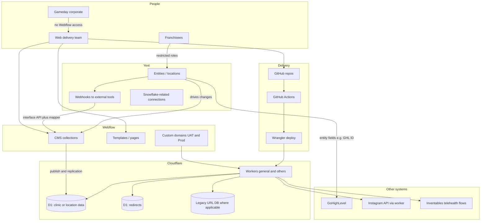
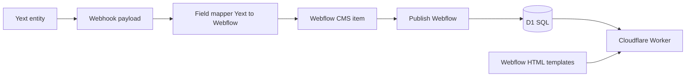
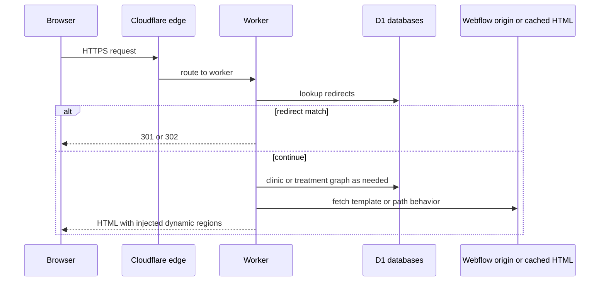

# Gameday web architecture (Ignite handover, May 2026)

Source: Ignite technical walkthrough (2026-05-06), verified against transcript. Prose meeting notes: `meetings/notes/2026-05-06-gameday-ignite-technical-architecture-handover.md`. For ownership and open questions, see `context/gameday-architecture-attention.md` and the `gameday-architecture` repo when that is updated.

## 1. System context (who talks to what)

## 2. Source of truth and sync (normal path)

**Authoritative rule from the session:** Yext is the source of truth for live location entities. Webflow and D1 reflect that chain. The D1 database is not edited manually for routine changes; Webflow may still hold items that Yext does not know about (for example “coming soon” clinics created only in Webflow).

**Asymmetric cases (called out in the meeting):**

- **Coming soon locations:** Created or maintained in **Webflow CMS** for SEO or presences; **not** represented in Yext until/unless promoted.
- **Deletes / closures:** **Not** fully automated from Yext deletes. Process is **manual** for governance: adjust Webflow (unpublish or delete), clear related D1 rows, then flag **closed** in Yext (and related listing or GBP handling as described).

## 3. Page request path (how a URL becomes HTML)

Webflow provides **templates** (including minimal or “blank” regions). Workers read **D1** (clinic, service, treatment relationships) to support **URL structures Webflow cannot natively express** (for example clinic slash category slash treatment depth). Workers may also merge **sitemap** data starting from Webflow’s sitemap and enriching it (legacy URLs, per-location maps).

## 4. Workers called out (non-exhaustive)

| Area | Role (from session) |
|------|---------------------|
| **General worker** | Bindings to D1, main injection logic, Instagram injection into iframe, sitemap-per-location logic, much of the “bridge” behavior |
| **Sitemap index worker** | Builds index layer; combines with per-location sitemap behavior |
| **robots.txt worker** | Control directives; filter legacy paths such as `wp-admin` |
| **Inventables** | Proxy patterns for telehealth flows |
| **Lobby** | Experimental worker; may be retired if approach changes |
| **Instagram** | API keys in worker; embed or iframe on home pages |

Exact worker names in Cloudflare should match their dashboard and GitHub; treat this table as functional grouping.

## 5. Deploy and environments

- **Workers:** Source in **GitHub**; deploy via **GitHub Actions** and **Wrangler** (`wrangler deploy`, environments in repo such as `workflows`).
- **Webflow:** **One** CMS backing both UAT and production-style domains; **one** D1 reflects that single CMS. Workers can still branch **behavior** by hostname (for example 404 on dev before prod) without splitting D1.
- **Org migration:** Repositories moving to **Gameday GitHub Enterprise**; pipelines expected to survive transfer if tokens and secrets are reattached.

## 6. Intentional gaps for follow-up

- **AWS:** Discussed as important for billing and broader stack; **webhook demo was centered on Yext**, not a full AWS topology in this session. Add an AWS box when inventory is confirmed (services that feed warehouse, Lambdas, etc.).
- **Snowflake:** Separate deep dive with Russ and Ignite’s data analyst.
- **Zendesk / Monday.com:** Process tooling; not part of this runtime diagram.

---

_Changes from raw transcript spellings: Yext normalized from “Jax”, MCP implied where “NCP” appeared._
